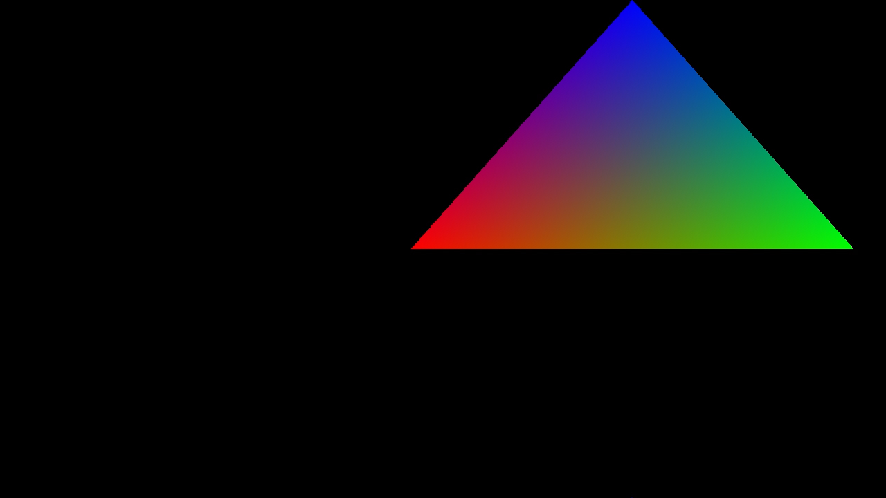
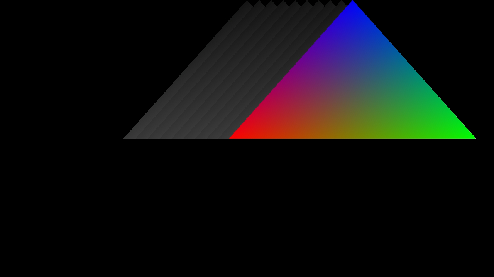

# NV12 not clearing on NVIDIA bug

1. Clone the repo (with the submodules)

```
git clone --recurse-submodules https://github.com/noituri/nvidia-nv12-bug-repro.git
```

2. Build
```
mkdir build
cd build
cmake ..
make
```

3. Run
```
./bug_repro
```

The program will generate 10 images of consecutive frames.
On each frame there's a triangle which moves from left to right.
Each frame is produced in 3 steps:
  1. Render triangle onto Y and UV plane of NV12 (each plane is cleared)
  2. Convert NV12 to RGBA
  3. Save RGBA bytes to jpg


## What's the bug?
Y plane of NV12 image is not cleared on NVIDIA's linux driver.

## Expected output (10th output frame):


- GPU: AMD Radeon RX 7800 XT
- Driver Version: Mesa 25.2.7
- Kernel: 6.18.6-200

## Output on NVIDIA (10th output frame):


- GPU: NVIDIA GeForce RTX 3060
- Driver Version: 590.48.01
- Kernel: 6.14.0-37-generic 
